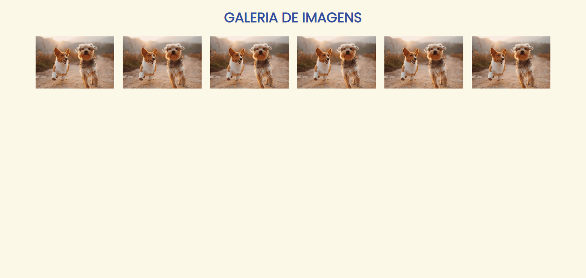

# Galeria de imagens

Neste repositório, o intuito partiu-se de criar uma galeria responsiva sem o uso de media queries apenas com display: grid; e o treino para criação/utilização de css utilitário.

Créditos da imagem ao criador @alvannee
Utilizei o squoosh.app para diminuir o tamanho da imagem para o site carregar mais rápido.

Desenvolvimento: 06/05/2022

